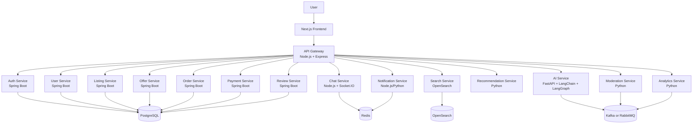

# MarketX

A scalable, production-style second-hand marketplace inspired by the C2C marketplace model of OLX, designed as a microservices-based platform for learning, collaboration, and real-world system design.

> Current repository status: this repository currently contains a minimal API gateway scaffold in `api-gateway/`. The full marketplace architecture described below is the intended target design for the project and is still in planning and incremental implementation.

## 1. Project Overview

MarketX is a C2C (consumer-to-consumer) marketplace for buying and selling second-hand goods. The system is designed to demonstrate modern backend architecture patterns, distributed service design, AI-assisted workflows, real-time communication, and cloud-native deployment practices.

The project aims to provide a contributor-friendly environment where developers can collaborate across multiple service stacks, including Java/Spring Boot, Node.js, Python, and frontend frameworks, while maintaining a clear service boundary model.

This repository is intended to serve as a learning platform and a foundation for an advanced marketplace implementation. It is not a finished production marketplace yet; instead, it follows a staged architecture that can grow from an initial gateway scaffold into a fully distributed platform.

## 2. Problem Statement

Modern marketplace platforms must handle:

- High traffic and dynamic inventory updates
- Real-time buyer-seller communication
- Search and personalization at scale
- Moderate to high moderation and fraud detection needs
- Secure authentication and authorization
- Payment, order, and dispute workflows
- Multi-service coordination without tightly coupled codebases

A single monolith becomes difficult to scale, secure, and evolve as business requirements grow. MarketX addresses this by decomposing the platform into domain-focused services that can evolve independently while staying coordinated through an API gateway, messaging, and shared infrastructure.

## 3. Goals

The project is designed to:

- Build a production-style C2C marketplace architecture
- Demonstrate microservice design and service ownership
- Use different technology stacks in a single ecosystem
- Add AI-driven features such as recommendation and moderation
- Support real-time communication and background processing
- Improve contributor onboarding and service independence
- Provide a realistic DevOps and deployment story using Docker, Kubernetes, CI/CD, and cloud-native patterns

## 4. Key Features

### Marketplace features

- Authentication and user access control
- User profiles and seller verification
- Listing creation, editing, and deletion
- Multiple listing images and categories
- Search and advanced filtering
- Location-aware listing discovery
- Wishlist and recently viewed items
- Buyer/seller chat
- Notifications and alerts
- Offers and negotiation workflows
- Order and payment flows
- Reviews and ratings
- Reporting and moderation workflows
- Admin moderation and review capabilities

### AI features

- AI-generated listing descriptions
- AI price estimation
- Semantic search
- Similar-listing recommendations
- Personalized recommendations
- Fraud and spam detection
- Image moderation
- AI-powered customer support
- LangChain and LangGraph workflow orchestration

### Platform and systems features

- API gateway routing and request control
- JWT and OAuth-ready authentication
- Role-based authorization
- Rate limiting and request timeout handling
- Redis caching
- Kafka or RabbitMQ async communication
- Background workers
- WebSockets for chat and updates
- Distributed logging and traces
- Monitoring and health checks
- Docker and Kubernetes deployment readiness
- CI/CD automation and infrastructure as code

> Planned: Many of the features above are part of the target architecture. They are not yet fully implemented in this repository unless explicitly present in the code.

## 5. Architecture Overview

MarketX uses a layered platform architecture:

1. Frontend users interact with a Next.js application.
2. Requests are routed through a Node.js API gateway.
3. Business logic is split across domain-specific microservices.
4. Data and operational concerns are separated into databases, caches, queues, search, and observability services.
5. AI-driven services enhance moderation, listing optimization, recommendations, and search.

## 6. Architecture Diagram

### ASCII overview

```text
                +----------------------+
                |   Next.js Frontend   |
                +----------+-----------+
                           |
                           v
                +----------------------+
                |  Node.js API Gateway |
                +----------+-----------+
                           |
        +------------------+------------------+
        |                                     |
        v                                     v
+-------------------+              +----------------------+
| Spring Boot       |              | Node.js / Python     |
| Auth / User /     |              | Chat / Notification  |
| Listing / Offer / |              | Search / AI /        |
| Order / Payment / |              | Recommendation /     |
| Review / Admin    |              | Moderation /        |
+-------------------+              | Analytics / etc.     |
                                     +----------------------+
                                               |
                                               v
                 +--------------------+--------------------+
                 | PostgreSQL | Redis | Kafka/RabbitMQ    |
                 | OpenSearch | Object Storage            |
                 +----------------------------------------+
```

### Mermaid diagram



## 7. Microservices Table

| Service name | Technology | Responsibility | Port placeholder |
| --- | --- | --- | --- |
| `frontend` | Next.js + TypeScript | User-facing marketplace application | 3000 |
| `api-gateway` | Node.js + Express | Single entry point, routing, rate limiting, auth checks, proxying | 5000 |
| `auth-service` | Spring Boot | Authentication, JWT, user sessions, OAuth-ready flows | 8081 |
| `user-service` | Spring Boot | User profile, seller verification, account management | 8082 |
| `listing-service` | Spring Boot | Listings, categories, inventory lifecycle | 8083 |
| `offer-service` | Spring Boot | Negotiation, offer creation, offer workflow | 8084 |
| `order-service` | Spring Boot | Order placement, fulfillment status, transaction tracking | 8085 |
| `payment-service` | Spring Boot | Payment orchestration and settlement flows | 8086 |
| `review-service` | Spring Boot | Ratings, reviews, and trust signals | 8087 |
| `chat-service` | Node.js + Socket.IO | Real-time buyer/seller messaging | 5001 |
| `notification-service` | Node.js or Python | Push/email/in-app notifications | 5002 |
| `search-service` | OpenSearch | Full-text and semantic search indexing | 9200 |
| `recommendation-service` | Python | Similar-item and personal recommendation logic | 8001 |
| `ai-service` | Python + FastAPI + LangChain + LangGraph | AI workflows and assistants | 8002 |
| `moderation-service` | Python | Image and listing moderation, fraud detection | 8003 |
| `analytics-service` | Python | Aggregations, metrics, and reporting | 8004 |

> These ports are placeholders for planning and contributor onboarding. They are not guaranteed to match future implementation details.

## 8. Folder Structure

```text
marketplace/
├── frontend/
│   └── Next.js + TypeScript
├── backend/
│   ├── api-gateway/
│   │   └── Node.js + Express
│   ├── auth-service/
│   │   └── Spring Boot
│   ├── user-service/
│   │   └── Spring Boot
│   ├── listing-service/
│   │   └── Spring Boot
│   ├── offer-service/
│   │   └── Spring Boot
│   ├── order-service/
│   │   └── Spring Boot
│   ├── payment-service/
│   │   └── Spring Boot
│   ├── review-service/
│   │   └── Spring Boot
│   ├── chat-service/
│   │   └── Node.js + Socket.IO
│   ├── notification-service/
│   │   └── Node.js/Python
│   ├── search-service/
│   │   └── OpenSearch
│   ├── recommendation-service/
│   │   └── Python
│   ├── ai-service/
│   │   └── Python + FastAPI + LangChain + LangGraph
│   ├── moderation-service/
│   │   └── Python
│   └── analytics-service/
│       └── Python
├── infrastructure/
│   ├── docker/
│   ├── terraform/
│   └── kubernetes/
├── .github/
│   └── workflows/
├── docker-compose.yml
├── .env.example
├── README.md
└── .gitignore
```

### Current repository structure

```text
MarketX/
├── .git/
├── api-gateway/
│   ├── index.js
│   ├── package.json
│   └── package-lock.json
├── client/
├── server/
├── Readme.md
└── .gitignore
```

This repository currently contains the foundation of the gateway layer. The remaining services and infrastructure files are planned additions.

## 9. How the API Gateway Works

The current repository contains an Express-based API gateway in `api-gateway/index.js`.

At the moment, the gateway:

- Creates an Express application
- Enables CORS
- Adds security headers via Helmet
- Uses Morgan for request logging
- Disables the Express `x-powered-by` header
- Enforces a basic in-memory rate limit per IP
- Sets a request timeout
- Proxies selected routes to target endpoints

The gateway currently includes example route mappings for:

- `/auth`
- `/users`
- `/chats`
- `/payment`

This is a minimal starting point for a larger gateway design. In the full architecture, the gateway will act as the main ingress point for frontend requests and will forward traffic to the appropriate microservice while handling authentication, policy enforcement, routing, observability, and request limits.

## 10. How Services Communicate

The system will use a mix of communication patterns depending on the use case.

- REST for synchronous service-to-service requests
- WebSockets for real-time chat and live notifications
- Message queues such as Kafka or RabbitMQ for asynchronous workflows
- Event-driven integration between listing, order, moderation, and notification services

This helps prevent unnecessary coupling and allows services to remain independently deployable.

## 11. REST / WebSocket / Message Queue Architecture

### REST

Used for standard CRUD actions, authorization checks, and domain operations such as:

- Listing management
- Offer processing
- Orders and payments
- Reviews and user actions

### WebSocket

Used for:

- Real-time chat
- Seller/buyer status updates
- Notice delivery and ephemeral updates

### Message queues

Used for:

- Notifications after listing creation or order updates
- Moderation jobs after listing submission
- Search indexing after content changes
- Analytics and reporting pipelines

## 12. Database Architecture

The target architecture is multi-database and service-oriented.

- PostgreSQL for transactional data and relational domain models
- Redis for caching, session data, rate limiting support, and transient work queues
- OpenSearch for search and semantic retrieval
- Object storage for listing images and media
- Separate database ownership per service in the target architecture (or a shared relational model depending on the final implementation decision)

> Planned: The full database architecture is not yet implemented in the repository.

## 13. Redis Usage

Redis is planned for:

- Session caching
- Authentication token/session acceleration
- Rate limiting data storage
- Short-lived listing or search cache
- Job coordination and ephemeral state

## 14. Kafka / RabbitMQ Usage

A message broker is planned for:

- User events
- Listing creation events
- Offer and order status changes
- Notification dispatch
- Search indexing triggers
- AI moderation and recommendation events

The project intentionally keeps the messaging layer flexible so contributors can choose Kafka or RabbitMQ based on implementation needs.

## 15. OpenSearch Architecture

OpenSearch is planned to support:

- Full-text search across listings and user content
- Filtering by category, price, item type, and location
- Semantic retrieval for better search relevance
- Ranking and result boosting for high-quality listings

## 16. AI Architecture

AI services will sit close to search and recommendation flows.

- `ai-service` will host model orchestration and prompt workflows
- `LangChain` and `LangGraph` are planned for chain-based reasoning and agentic workflows
- `recommendation-service` handles personalized suggestions and similarity logic
- `moderation-service` will support spam and harmful content detection
- `listing-service` and `search-service` will integrate with AI-powered enrichment and search enhancements

This is a planned architecture for learning and experimentation; it is not yet fully implemented.

## 17. Authentication and Security

The long-term goal is to provide secure access across all services.

Planned aspects include:

- JWT-based authentication
- OAuth and identity-provider integration
- Role-based access control
- API gateway-level request policy checks
- Secure secret management
- Rate limiting and timeout protection
- Request tracing and auditability
- Protected service-to-service communication

The current gateway already contains basic protection patterns such as CORS, Helmet headers, and rate limiting logic. The broader security model remains a planned enhancement.

## 18. Local Development Setup

### Prerequisites

Before contributing, make sure the following tools are available:

- Git
- Node.js and npm
- Java JDK (for Spring Boot services)
- Python 3.x
- Docker and Docker Compose
- Optional: Kubernetes tooling (`kubectl`, `helm`) for deployment-related work

### Environment variables

A root-level `.env.example` file is planned, but it does not exist in this repository yet.

Suggested environment variables for future services include:

- `PORT`
- `JWT_SECRET`
- `DATABASE_URL`
- `REDIS_URL`
- `KAFKA_BROKER`
- `OPENSEARCH_URL`
- `AWS_S3_BUCKET`
- `SMTP_HOST`
- `CLIENT_URL`

Do not create or commit real secrets to the repository. Use local environment files and keep production credentials outside version control.

### Installation

Clone the project and install dependencies for the currently implemented gateway:

```bash
git clone <repository-url>
cd MarketX
cd api-gateway
npm install
```

To start the current gateway service:

```bash
cd api-gateway
node index.js
```

This is the exact command that matches the current implementation in `api-gateway/index.js`.

## 19. Running Individual Services

### Current repository

The only service with actual runnable code in this repo is the API gateway.

```bash
cd api-gateway
node index.js
```

### Planned service startup model

Each future service will typically follow a pattern like:

```bash
# Spring Boot service
./gradlew bootRun

# Node.js service
npm install
npm run dev

# Python service
python -m venv .venv
source .venv/bin/activate
pip install -r requirements.txt
uvicorn app.main:app --reload
```

> These service-specific commands are examples for future contributors and should be adapted to the actual project structure as each microservice is added.

## 20. Running the Complete System with Docker Compose

A root-level `docker-compose.yml` is planned but is not yet added to this repository.

When it is introduced, the expected goal is to provide a single command to start:

- Frontend
- API gateway
- Backend services
- PostgreSQL
- Redis
- Kafka or RabbitMQ
- OpenSearch
- Supporting observability stack

Planned command:

```bash
docker compose up --build
```

This is not yet verified against repository files and should be treated as a project target, not current implementation.

## 21. API Documentation

A project-level API contract and OpenAPI specification is planned.

Expected future documentation may include:

- Swagger/OpenAPI for each backend service
- Gateway-level route documentation
- Shared request/response examples
- Authentication flows and error contracts

Current repository status: no verified service API specs are present yet.

## 22. Testing

The repository does not yet contain a full implemented test suite for the marketplace platform.

The current API gateway package script is:

```json
"test": "echo \"Error: no test specified\" && exit 1"
```

This means the current `npm test` command in `api-gateway` is a placeholder and is not a valid test suite.

Planned testing strategy:

- Unit tests for service logic
- Integration tests between services and databases
- API contract tests
- End-to-end tests for marketplace flows
- Load and performance testing for scale validation

## 23. Git Workflow

Use a clean branching workflow so microservice work stays isolated and reviewable.

1. Clone the repository.
2. Create a branch for your work.
3. Keep commits focused and descriptive.
4. Run relevant tests or validation checks locally.
5. Push the branch to the remote.
6. Open a pull request for review.

## 24. Branch Naming Convention

Use consistent names for every branch:

- `feature/add-listing-service`
- `fix/auth-token-validation`
- `chore/update-api-gateway-security`
- `docs/marketplace-readme`
- `refactor/order-service-flow`

Recommended convention:

```text
<type>/<short-description>
```

Examples of valid types:

- `feature`
- `fix`
- `docs`
- `chore`
- `refactor`
- `test`

## 25. Commit Convention

Use clear, conventional commits for maintainability.

Examples:

```bash
git commit -m "feat: add listing creation endpoint"
git commit -m "fix: correct auth middleware timeout handling"
git commit -m "docs: update contributor onboarding guide"
git commit -m "chore: configure gateway proxy routes"
```

Keep commit messages short, specific, and action-oriented.

## 26. How Contributors Can Add a New Service

Follow this pattern when building a new microservice:

1. Decide the service boundary and domain responsibility.
2. Create a dedicated folder under the appropriate backend area.
3. Define the service’s API contract and data model.
4. Add required environment variables.
5. Register the service with the API gateway if it needs public routing.
6. Document the service in the README and architecture notes.
7. Add health checks and basic observability.
8. Add tests for the service’s contract and business logic.

### Spring Boot contributor guidance

If you are working with Spring Boot, keep the following in mind:

- Keep domain logic inside the service boundary.
- Avoid tightly coupling the service to the gateway.
- Prefer explicit DTOs and service contracts over hidden shared state.
- Add environment-based configuration rather than hardcoded values.
- Keep the service independently runnable.
- Document ports and endpoints clearly.
- Use consistent naming and package organization.

For a Spring Boot microservice, a safe pattern is:

- `controller/` for HTTP endpoints
- `service/` for business logic
- `repository/` for persistence access
- `model/` or `entity/` for domain classes
- `config/` for app config and security settings
- `dto/` for request/response contracts

## 27. Pull Request Guidelines

Before opening a PR:

- Ensure your branch is up to date with the target branch
- Keep changes focused and reviewable
- Add or update tests where appropriate
- Document environment or configuration changes
- Make sure the code runs locally in your service context
- Include a clear summary of what changed and why

PR template suggestions:

- Summary
- Problem addressed
- Changes made
- Testing performed
- Risks and considerations

## 28. Coding Standards

Contributors are expected to follow a consistent standard across languages and services.

General guidance:

- Write clear, understandable code
- Use meaningful names
- Keep methods and functions small
- Favor explicit configuration over magic values
- Document assumptions
- Avoid exposing secrets in code or logs
- Prefer small, testable units of logic

Language-specific style should follow the conventions of the relevant stack:

- Java/Spring Boot: idiomatic Spring conventions and clean package boundaries
- Node.js: ESLint-based style, clear route structure, secure middleware patterns
- Python: PEP 8 compliance, type hints where appropriate, clear async boundaries
- Frontend: maintainable component design, proper TypeScript usage, shared API wrappers

## 29. Deployment Architecture

The intended deployment model is cloud-native and service-oriented:

- Containerized services via Docker
- Container orchestration via Kubernetes
- Infrastructure managed with Terraform
- CI/CD via GitHub Actions
- Monitoring with Prometheus and Grafana
- Service health checks and centralized logging

> This is a target deployment model and is not yet implemented as a working infrastructure stack in the repository.

## 30. CI/CD

Planned GitHub Actions pipelines include:

- Lint checks
- Test execution
- Docker build validation
- Security scans
- Deployment automation for staging and production

A `.github/workflows/` directory is planned but not yet added to this repository.

## 31. Kubernetes Deployment

Kubernetes is planned for future deployment and orchestration.

Target goals:

- Deploy services as independent pods
- Use ingress for external traffic
- Manage config and secrets via environment-driven configuration
- Support horizontal scaling
- Track readiness and liveness health checks

## 32. Monitoring and Logging

The long-term platform should include:

- Application logs
- Request tracing
- Metrics dashboards
- Alerting for service degradation
- Health checks and uptime monitoring

Recommended tools include:

- Prometheus
- Grafana
- Centralized log aggregation
- Service-level health endpoints

## 33. Troubleshooting

Common contributor issues:

- Service not reachable through the gateway
  - Confirm the gateway target URL is correct
  - Verify that the service is running
  - Check CORS and path rewrite rules

- Rate limiting errors
  - Verify the request source IP and time window logic
  - Recheck application config if using a proxy or load balancer

- Missing environment variables
  - Validate `.env` or local config files before running a service

- Port conflicts
  - Check active processes with `lsof` or `ss` and stop conflicting services

- Module or dependency issues
  - Reinstall dependencies for the specific service
  - Confirm the correct Node.js or Python environment is active

## 34. Planned Features

The following features are part of the roadmap and should be treated as planned work, not implemented functionality unless present in code:

- Advanced admin moderation workflows
- AI customer support and chat automation
- Geo-based listing recommendations
- Full analytics and reporting dashboards
- Kubernetes production deployment
- Terraform-managed cloud infrastructure
- High-scale search and ranking improvements
- Advanced fraud detection and trust scoring
- Full real-time notification infrastructure
- End-to-end payment settlement flows

## 35. Contributors

This project is intended to be a collaborative platform for developers who want to work on distributed systems, backend architecture, AI, and modern marketplace design.

Contributors are encouraged to:

- Build domain-focused services
- Keep interfaces explicit and well documented
- Follow secure coding practices
- Propose architecture improvements through pull requests
- Keep the project approachable for new developers

## 36. License

This project does not yet specify a license.

Before publishing or distributing the software publicly, decide on an appropriate license such as MIT or Apache 2.0 and add the corresponding license file to the repository.

---

## Contributor Quickstart

If you are new to the project, start here:

1. Clone the repository.
2. Create a feature branch.
3. Configure local environment variables.
4. Install dependencies for the service you are working on.
5. Start the required service or dependencies.
6. Run the service locally.
7. Validate behavior with targeted tests or checks.
8. Commit with a clear message.
9. Push your branch.
10. Open a pull request and request review.

### Example flow

```bash
git clone <repository-url>
cd MarketX
git checkout -b feature/my-change
cd api-gateway
npm install
node index.js
```

### For a friend working on a Spring Boot microservice

When adding or modifying a Spring Boot microservice:

- keep the service isolated from the gateway logic
- define clear endpoints and DTOs
- test locally before integrating with the gateway
- document the service port and route prefix
- avoid changing shared contracts without informing other contributors
- keep database changes explicit and reviewable
- run the service independently before connecting it to the broader system

This keeps the whole project easier to debug and safer to evolve as the architecture grows.

---

## Final Note

This repository is a growing project and a practical architecture exercise in building a large-scale marketplace platform. It is intentionally designed to teach real software engineering patterns across frontend, backend, data, AI, and infrastructure layers.

The current implementation is deliberately minimal and honest: the API gateway scaffold exists, while the broader microservice ecosystem remains planned. Contributors should treat the README as the project source of truth for architecture, onboarding, and evolution.
